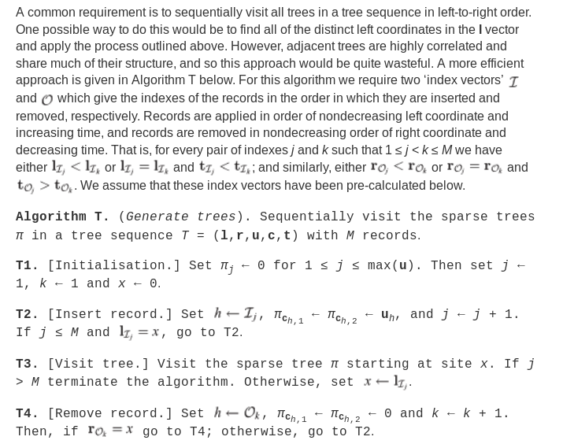

# Sparse trees

A sparse tree is a sequence $\pi$ of integers, 
with $\pi_k$ denoting the parent of node $k$,
and $0$ denoting no parent (as for example the root).


# Building a sparse tree from coalescent records

Since coalescent records record parent $u$ and children $c$,
to build a tree out of a set of records
one only needs to initialize the entries of $\pi$ all to 0,
and then to set the $c_i$th entries of $\pi$ all equal to $u$ for each $i$.


# Generating trees (the tree iterator)

Suppose we have the tree at $x$ and the next record to the right
begins at $\ell>x$.
The algorithm moves from this tree to the next (at $\ell$)
by first removing all records that end between $x$ and $\ell$
(by setting the parents of each of the children in each record to zero)
and then adding all new records beginning at $\ell$.



Note that this assumes that all relevant entries get zeroed out
when 'removing' records.

## Questions:

1.  Can we have partially observed tips that are not samples?

    * **Yes:** if the largest ID is an internal node (or we change how memory is allocated)

2.  Can we have the same internal node be the parent of more than on coalescent record
    at different times?


## Python version from Jerome

```{python}

def trees(records):
    M = len(records)
    I = sorted(range(M), key=lambda j: (records[j].left, records[j].time))
    O = sorted(range(M), key=lambda j: (records[j].right, -records[j].time))
    pi = [-1 for j in range(max(r.node for r in records) + 1)]
    chi = [[] for j in range(max(r.node for r in records) + 1)]
    j = 0
    k = 0
    while j < M:
        x = records[I[j]].left
        while records[O[k]].right == x:
            h = O[k]
            print("\tout:", records[h])
            chi[records[h].node] = []
            for q in records[h].children:
                pi[q] = -1
            k += 1
        while j < M and records[I[j]].left == x:
            h = I[j]
            print("\tin:", records[h])
            chi[records[h].node] = records[h].children
            for q in records[h].children:
                pi[q] = records[h].node
            j += 1
        yield pi, chi

```

# Clock time or meioses

Suppose that:

1. We start with individual $a$ at $t=0$.
2. $a$ gives birth to $b$ at $t=1$.
3. $b$ gives birth to $c$ at $t=2$.
4. $a$ gives birth to $d$ and $e$ at $t=3$.
5. $a$ and $b$ die and we sample $c$, $d$, and $e$ at $t=4$.

What should the tree be?
If we count in **meioses**, it should be

```
                                        
2            a _                        
            / \ \                       
1          b   d e                      
          /                             
0        c                              
```

Here, nodes = individuals.

On the other hand, if we count in **clock time**, then it should be

```
                                        
4       a                               
        |\                              
3       a b                             
        | |\                            
2       a b c                           
       /|\ \ \                          
1     a d e b c                         
        | |   |                         
0       d e   c                         
```

Here, nodes = (individuals at a particular point in time)


# Forwards-time algorithms

Requirements:

1.  Coalescence records have at least two offspring.
2.  Coalescence records are output in time-order.
3.  We need to be able to re-label so samples have the first $n$ labels at the end.


## Without recombination

This algorithm will be in **clock time**.

Now:
the idea is that each branch of the tree gets a label;
so we record coalescence records then a branch splits.
As we move forwards in time, we keep track of:

-  `C` : the current state, a list of *tips*
-  each `tip` is : 

    * a unique label
    * an ordered list of individuals on that branch 
        that are currently alive, with the most recent at the end
    * an ordered list of birth times of those individuals

and we write out coalescent records, which are:

- `[parent, offspring, time]` : parent and offspring are labels of branch tips; 
    the `time` is the time of *birth of the offspring*,
    so we measure time in *clock time*.

## Example

Here's the example above, extended slightly:

1. We start with individual $a$ at $t=0$.
2. $a$ gives birth to $b$ at $t=1$.
3. $b$ gives birth to $c$ at $t=2$.
4. $a$ gives birth to $d$ and $e$ at $t=3$.
5. $b$ gives birth to $f$ and $a$ and $b$ die at $t=4
6. We sample $c$, $d$, $e$, and $f$.

With lineage labels on the right, and time now moving forwards:
```
------------
time   tree        |   lineages        records output

0       a          |       0         

------------

0       a          |       0           
        |\         |       |\                         
1       a b        |       0 0         

------------

0       a          |       0           [ 0, (1,2), 0 ]               
        |\         |       |\                         
1       a b        |       1 2         
        | |\       |       | |\                       
2       a b c      |       1 2 2       

------------
                                        
0       a          |       0           
        |\         |       |\                         
1       a b        |       1 2         
        | |\       |       | |\                       
2       a b c      |       1 2 2       [ 1, (3,4,5), 2 ]               
       /|\ \ \     |      /|\ \ \                     
3     a d e b c    |     3 4 5 2 2                    

------------
                                        
                                        
0       a          |       0           
        |\         |       |\                         
1       a b        |       1 2         
        | |\       |       | |\                       
2       a b c      |       1 2 2       
       /|\ \ \     |      /|\ \ \                     
3     a d e b c    |     3 4 5 2 2                    
        | |   |    |       | |   |                    
4       d e   c    |       4 5   2                    

------------
                                        
0       a          |       0           
        |\         |       |\                         
1       a b        |       1 2         
        | |\       |       | |\                       
2       a b c      |       1 6 7       
       /|\ \ \     |      /|\ \ \                     
3     a d e b c    |     3 4 5 6 7                    
      | | | |\ \   |       | |  \ \                   
4     * d e * f c  |       4 5   6 7   [ 2, (6,7), 1 ]              

```

Note that we've output the records not quite in time order.

## Algorithm


Events that happen at a given time will be births and deaths.

0.  Begin with `C = ` a tip for each extant individual. 
1.  First deal with **births**, in order by age of parent (oldest parents first).
    For each new parent,
    check where that parent is in the birth order of its tip.
    
    -  If it is at the end (the most recent birth),
        and the number of offspring is 1,
        then add the new individual to the end of the list of individuals for that tip.

    -  If it is *not* at the end, 
        or she had more than one offspring,
        then split the tip:
        if the old tip is $L_0 : (a_1, \ldots, a_n)$,
        the parent is $a_k$, and the offspring are $b_1, \ldots, b_m$,
        then:

        1.  Make new tips:
            if $k>1$, a new tip $L'_{1} : (a_1, \ldots, a_k)$;
            if $k<n$, a new tip $L'_{2} : (a_{k+1}, \ldots, a_n)$;
            and $L_j : (b_j)$ for $1 \le j \le m$.

        2.  Record the coalescence record $(L_0, (L_1,\ldots,L_m), ??) $

2.  If the event is a `death` : 
    remove the individual from the tip they are in, 
    and remove the tip if it is empty.


